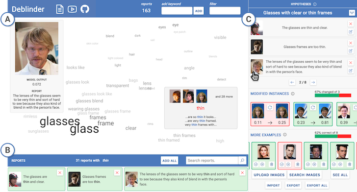

# Deblinder: Discovering and Validating AI Errors with Crowdsourced Failure Reports

Deblinder is a visual analytics system for exploring **failure reports**, descriptions from end-users of how or why a model failed.
Deblinder consists of a word embedding visualization for making sense of the reports, and a sidebar for validating hypotheses of systematic failures.
To learn more about Deblinder and failure reports, check out the full paper:

**[Discovering and Validating AI Errors With Crowdsourced Failure Reports](https://dl.acm.org/doi/10.1145/3479569)**
Ángel Alexander Cabrera, Abraham J. Druck, Jason I. Hong, Adam Perer
Proceedings of the ACM on Human-Computer Interaction, Volume 5, Issue CSCW2

## Installation

1. Install Python dependencies with `pip install -r requirements.txt`
2. Install JS dependencies and compile the frontend with `cd client; yarn; yarn build`
3. Run the server with `python app.py`

## Using New Data

Use the following instructions to use a new dataset and model:

1. Follow `preprocessing.ipynb` to generate the embedding vectors for a new dataset.
2. Copy the metadata table with the vectors as `data.csv` in `client/public/`
3. Copy the static images to `img/`
4. Update the model calls in `app.py` to the new model.
